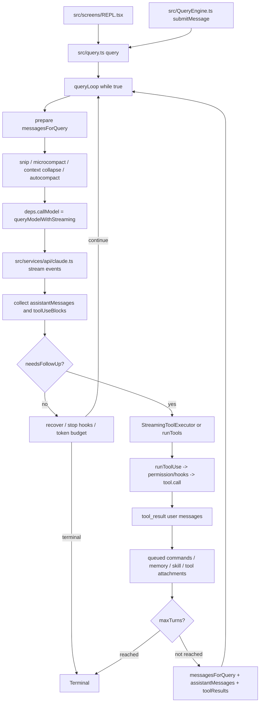

# Claude Code Agentic Loop 代码走读

本文只分析 Claude Code 如何跑 agentic loop，不展开 CLI 启动、UI 组件、MCP 配置、插件市场等外围架构。核心结论是: 这份代码里的 agent loop 主要由 `src/query.ts` 实现，它是一个 async generator 驱动的状态机。一次用户输入可能触发多次模型请求:

1. 准备上下文和系统提示词。
2. 调用模型并流式消费 assistant blocks。
3. 如果流里出现 `tool_use` block，就执行对应工具。
4. 把工具结果转换成 `user` 消息里的 `tool_result` block。
5. 用 `messages + assistantMessages + toolResults` 构造下一轮 state，继续请求模型。
6. 如果没有 `tool_use`，进入 stop hook、token budget、错误恢复等终止判断。

代码上最重要的一点: loop 不信任 `stop_reason === "tool_use"`。真正的继续条件是流式 assistant message 里是否出现 `tool_use` block，出现就把 `needsFollowUp` 置为 `true`。代码位置: `src/query.ts:734-751`, `src/query.ts:1064-1087`。

## 一页流程



## 入口: REPL 和 Headless 最终都进 query()

交互模式里，`REPL.tsx` 在用户提交后构造 `toolUseContext`，重新读取 fresh tools / MCP clients，加载 system prompt、user context、system context，然后直接 `for await` 消费 `query()` 的事件。代码位置: `src/screens/REPL.tsx:3335-3413`。

Headless / SDK 模式走 `QueryEngine.submitMessage()`。`QueryEngine` 是“一次会话一个 engine”，`mutableMessages`、file cache、usage 等跨用户 turn 保留。每次 `submitMessage()` 先处理用户输入和 slash command，写 transcript，然后调用同一个 `query()`。代码位置: `src/QueryEngine.ts:183-190`, `src/QueryEngine.ts:217-244`, `src/QueryEngine.ts:420-441`, `src/QueryEngine.ts:688-699`。

所以可以把调用栈简化成:

```text
REPL 用户提交
  -> REPL.tsx 构造 ToolUseContext / prompt context
  -> query()
  -> queryLoop()

Headless / SDK 用户提交
  -> QueryEngine.submitMessage()
  -> processUserInput()
  -> query()
  -> queryLoop()
```

## query() 外壳负责 turn 生命周期

`query()` 本身是一个 async generator，yield 的类型包括 stream event、request start、普通 message、tombstone、tool-use summary，return 的类型是 `Terminal`。代码位置: `src/query.ts:275-284`。

`query()` 外壳做三件事:

- 创建或复用 Langfuse trace，并把 trace 塞回 `toolUseContext`，让工具执行也能记录 observation。代码位置: `src/query.ts:288-313`。
- `yield* queryLoop(...)`，真正 agent loop 在 `queryLoop()`。代码位置: `src/query.ts:315-323`。
- finally 里收尾 autonomy commands、关闭 trace、清理性能 buffer、标记 consumed command completed。代码位置: `src/query.ts:329-389`。

换句话说，`query()` 是一次用户 turn 的生命周期壳，`queryLoop()` 才是多次“模型-工具-模型”循环。

## 核心数据结构

`QueryParams` 是进入 loop 的静态输入，包含:

- `messages`: 当前会话消息。
- `systemPrompt`, `userContext`, `systemContext`: 三类 prompt/context。
- `canUseTool`: 工具权限决策函数。
- `toolUseContext`: 工具执行需要的上下文。
- `fallbackModel`, `querySource`, `maxTurns`, `taskBudget`, `deps` 等运行参数。

代码位置: `src/query.ts:237-255`。

`State` 是 loop iteration 之间携带的可变状态，包含:

- `messages`: 下一次请求要基于哪段 history。
- `toolUseContext`: 当前工具上下文。
- `autoCompactTracking`: 自动压缩状态。
- `maxOutputTokensRecoveryCount`, `maxOutputTokensOverride`: 输出 token 恢复相关。
- `hasAttemptedReactiveCompact`: 防止 reactive compact 死循环。
- `pendingToolUseSummary`: 上一批 tool use summary 的异步任务。
- `stopHookActive`: stop hook retry 防循环。
- `turnCount`: agentic turn 数。
- `transition`: 上一轮为什么继续。

代码位置: `src/query.ts:257-273`。

`ToolUseContext` 是工具层的运行时大包，里面有当前 tools、MCP clients、permission/app state getter/setter、abort controller、readFileState、消息、in-progress tool IDs、agentId、queryTracking、Langfuse span、content replacement state 等。代码位置: `src/Tool.ts:160-321`。

`Tool` 接口定义了每个工具必须提供的能力: `call()`、`description()`、`inputSchema`、`isConcurrencySafe()`、`isReadOnly()`、`interruptBehavior()`、MCP 信息、`maxResultSizeChars` 等。代码位置: `src/Tool.ts:383-490`。

## queryLoop 的每轮准备阶段

`queryLoop()` 初始化一次 `State`，`turnCount` 从 1 开始，并 snapshot 一份 `QueryConfig`。`QueryConfig` 只抓 runtime gates，例如 streaming tool execution、tool-use summary、fast mode，不包含 `feature()` gates，因为 `feature()` 是 Bun bundle 的 tree-shaking 边界，必须留在原 guarded block。代码位置: `src/query.ts:392-459`, `src/query/config.ts:8-46`。

每次 `while (true)` 开头会做这些准备:

1. 启动 skill/tool discovery prefetch，让它们和模型 streaming、工具执行并行。代码位置: `src/query.ts:475-493`。
2. yield `stream_request_start`，并更新 query chain tracking。代码位置: `src/query.ts:494-520`。
3. 用 `getMessagesAfterCompactBoundary(messages)` 得到本轮真正发给 API 的 history。代码位置: `src/query.ts:522`。
4. 删除旧 `user` 消息上的 raw `toolUseResult`，只保留 API 需要的 `message.content`，避免长会话内存膨胀。代码位置: `src/query.ts:524-538`。
5. 对工具结果做 aggregate budget replacement。代码位置: `src/query.ts:542-567`。
6. 可选 HISTORY_SNIP。代码位置: `src/query.ts:569-583`。
7. microcompact。代码位置: `src/query.ts:585-609`。
8. 可选 context collapse。代码位置: `src/query.ts:611-630`。
9. 把 system context append 到 system prompt。代码位置: `src/query.ts:632-634`。
10. autocompact，成功时 yield compact 后的 messages，并用 post-compact messages 替换 `messagesForQuery`。代码位置: `src/query.ts:636-718`。
11. 把 `toolUseContext.messages` 更新成 `messagesForQuery`。代码位置: `src/query.ts:728-732`。

这一步完成后，loop 准备了三组本轮局部数组:

- `assistantMessages`: 本轮模型 stream 出来的 assistant message blocks。
- `toolResults`: 本轮工具执行产生的 user/tool_result 或 attachment。
- `toolUseBlocks`: 本轮从 assistant content 里抓到的 local tool calls。

代码位置: `src/query.ts:734-741`。

## 模型调用阶段

`queryLoop()` 通过 `deps.callModel()` 调模型。生产依赖里，`callModel` 就是 `queryModelWithStreaming`；`microcompact` 和 `autocompact` 也通过 `deps` 注入，便于测试替换。代码位置: `src/query/deps.ts:21-40`。

正式调用时，`query.ts` 传入:

- `messages: prependUserContext(messagesForQuery, userContext)`
- `systemPrompt: fullSystemPrompt`
- `thinkingConfig`
- `tools: toolUseContext.options.tools`
- `signal: toolUseContext.abortController.signal`
- `options`: permission context getter、model、fastMode、fallbackModel、querySource、agents、MCP tools、pending MCP servers、queryTracking、taskBudget、Langfuse trace 等。

代码位置: `src/query.ts:877-934`。

调用前还有两个重要保护:

- hard blocking limit: 未自动压缩且接近上下文硬限制时，直接返回 `blocking_limit`。代码位置: `src/query.ts:775-830`。
- predictive autocompact: 预估本轮增长会超过上下文窗口时，提前压缩。代码位置: `src/query.ts:833-873`。

## API streaming 如何变成 assistant messages

`queryModelWithStreaming()` 只是一个 streaming wrapper，真正事件处理在 `queryModel()`。代码位置: `src/services/api/claude.ts:775-803`。

`queryModel()` 构造 Anthropic request params 时，会把当前 messages、system、tools、tool choice、betas、max_tokens、thinking、context management、output format、fast mode speed 等合成到请求体。代码位置: `src/services/api/claude.ts:1608-1801`。

streaming 采用 raw stream，而不是 SDK 的 `BetaMessageStream`，原因是工具参数的 partial JSON 自己累积，避免 SDK 对 `input_json_delta` 做 O(n^2) partial parse。代码位置: `src/services/api/claude.ts:1898-1915`。

事件处理要点:

- `message_start`: 保存 `partialMessage`，记录 TTFT 和 usage。代码位置: `src/services/api/claude.ts:2060-2074`。
- `content_block_start`: 如果是 `tool_use`，先把 block 的 `input` 设为空字符串；如果是 text，就初始化 text delta buffer；thinking 也单独累积。代码位置: `src/services/api/claude.ts:2075-2133`。
- `content_block_delta`: `input_json_delta` 追加到 tool/server-tool 的 `input` 字符串；`text_delta` 先 push 到数组，最后 join；thinking delta 追加到 thinking。代码位置: `src/services/api/claude.ts:2134-2253`。
- `content_block_stop`: 把一个 content block 组装成 `AssistantMessage` 并 yield。代码位置: `src/services/api/claude.ts:2254-2301`。
- `message_delta`: 把最终 usage 和 `stop_reason` 直接写回最后一个已 yield 的 message；如果 stop reason 是 `max_tokens` 或 `model_context_window_exceeded`，yield synthetic API error message。代码位置: `src/services/api/claude.ts:2303-2386`。
- 每个 raw event 还会 yield 一个 `stream_event` 给上层 UI/SDK。代码位置: `src/services/api/claude.ts:2392-2397`。

这里有一个实现细节: `content_block_stop` 会按 content block 产出 assistant message，所以 `query.ts` 里的 `assistantMessages` 是一个数组，不是“完整 assistant 响应的单个对象”。

## query.ts 如何判断要不要继续

`query.ts` 消费 `deps.callModel()` 的每个 message。非 withheld message 会先 yield 给 UI/SDK。代码位置: `src/query.ts:968-1063`。

如果 message 是 assistant:

1. push 到 `assistantMessages`。
2. 从 `assistantMessage.message.content` 里筛出 `content.type === "tool_use"` 的 blocks。
3. 如果有 tool blocks，push 到 `toolUseBlocks`，并设置 `needsFollowUp = true`。
4. 如果启用了 streaming tool executor，就立即 `addTool()`，让工具可以在模型还没完全 stream 完时开始跑。

代码位置: `src/query.ts:1064-1087`。

注意: 这里只筛 `tool_use`，不筛 `server_tool_use`。`server_tool_use` 在 API 层可以被累积和 normalize，但不会进入本地工具执行分支。

streaming tool executor 还会在模型 streaming 期间不断 drain 已完成工具结果，把它们 yield 给 UI，并 normalize 成 API 可以回传的 `user` 消息加入 `toolResults`。代码位置: `src/query.ts:1090-1105`。

## 没有 tool_use 时: 完成、恢复或停止

模型 stream 结束后，如果 `needsFollowUp` 为 false，说明本轮没有本地工具要执行。此时不是马上完成，而是依次走恢复和停止逻辑。

主要分支:

- prompt too long / media size: 先尝试 context collapse drain，再尝试 reactive compact；成功就改写 `state` 并 `continue`。代码位置: `src/query.ts:1334-1455`。
- max output tokens: 可先把 output tokens 提升到 64k 重试；仍不够时追加 meta user message 要模型继续，有限次数后才暴露错误。代码位置: `src/query.ts:1457-1528`。
- API error: 跳过 stop hooks，直接返回 `model_error`。代码位置: `src/query.ts:1530-1540`。
- stop hooks: `handleStopHooks()` 可能阻止 continuation，也可能产生 blocking errors 并要求 retry。代码位置: `src/query.ts:1542-1581`。
- token budget: 如果 `TOKEN_BUDGET` feature 开启，预算检查可能追加 nudge message 并继续。代码位置: `src/query.ts:1583-1630`。
- 都没有触发时，返回 `{ reason: "completed" }`。代码位置: `src/query.ts:1632`。

这些“继续但不执行工具”的分支会把 `State.transition` 设置成不同原因，例如 `reactive_compact_retry`、`max_output_tokens_recovery`、`stop_hook_blocking`、`token_budget_continuation`。完整类型见 `src/query/transitions.ts:13-20`。

## 有 tool_use 时: 执行工具

如果 `needsFollowUp` 为 true，`query.ts` 进入工具执行分支。工具执行有两套路径:

- streaming tool execution 开启: 使用 `StreamingToolExecutor.getRemainingResults()`。
- 未开启: 使用传统 `runTools(toolUseBlocks, assistantMessages, canUseTool, toolUseContext)`。

代码位置: `src/query.ts:1635-1657`。

工具执行产生的 update 会被 yield 给 UI/SDK。如果 update 里是 attachment `hook_stopped_continuation`，会标记 `shouldPreventContinuation`。同时 message 会被 normalize 成 API 格式里的 `user` 消息并追加到 `toolResults`。代码位置: `src/query.ts:1658-1683`。

### StreamingToolExecutor

`StreamingToolExecutor` 的目标是让工具在 stream 过程中尽早跑，而不是等整段 assistant response 结束。它维护一个 `TrackedTool[]` 队列，每个工具有 `queued/executing/completed/yielded` 状态、是否 concurrency-safe、pending progress、results、context modifiers。代码位置: `src/services/tools/StreamingToolExecutor.ts:21-42`。

`addTool()` 会:

- 首个工具时创建 Langfuse batch span。
- 查找 tool definition。
- 如果没有 tool，直接构造 error `tool_result`。
- 用工具的 zod schema parse input，并调用 `isConcurrencySafe()` 决定并发安全性。
- push 到队列后 `processQueue()`。

代码位置: `src/services/tools/StreamingToolExecutor.ts:87-151`。

并发规则:

- 当前没有执行中的工具，可以启动。
- 如果新工具是 concurrency-safe，且正在执行的工具全是 concurrency-safe，也可以启动。
- 非 concurrency-safe 工具需要独占，并且会阻塞后续队列。

代码位置: `src/services/tools/StreamingToolExecutor.ts:153-178`。

执行时，executor 会为每个工具创建 child abort controller，调用 `runToolUse()`，收集 progress 和最终 messages。Bash 出错会触发 sibling abort，取消后续 sibling 工具。代码位置: `src/services/tools/StreamingToolExecutor.ts:292-432`。

`getCompletedResults()` 保持结果顺序，同时 progress message 可以即时 yield；`getRemainingResults()` 等待剩余工具结束，并继续 yield progress / completed results。代码位置: `src/services/tools/StreamingToolExecutor.ts:434-520`。

### 传统 runTools

未启用 streaming executor 时，`runTools()` 会先把 tool calls 分批:

- 连续的 concurrency-safe tools 合成一批并发跑。
- 非 concurrency-safe tool 单独成批串行跑。

默认最大并发来自 `CLAUDE_CODE_MAX_TOOL_USE_CONCURRENCY`，未设置时是 10。代码位置: `src/services/tools/toolOrchestration.ts:9-20`, `src/services/tools/toolOrchestration.ts:38-97`, `src/services/tools/toolOrchestration.ts:101-130`。

并发批次通过 `runToolsConcurrently()` + `all(..., maxConcurrency)` 执行；串行批次通过 `runToolsSerially()` 一个个执行。代码位置: `src/services/tools/toolOrchestration.ts:133-196`。

## 单个工具调用的内部流水线

单个工具调用入口是 `runToolUse()`。它会:

1. 根据 `toolUse.name` 在当前可用 tools 中找工具。
2. 如果找不到，再尝试 deprecated alias fallback。
3. 找不到工具时返回 error `tool_result`。
4. 如果 abort 已发生，返回 cancel `tool_result`。
5. 正常情况下进入 `streamedCheckPermissionsAndCallTool()`。

代码位置: `src/services/tools/toolExecution.ts:366-519`。

`streamedCheckPermissionsAndCallTool()` 把 progress 和最终结果包装成一个 async iterable。工具执行期间的 progress 会 enqueue 成 `ProgressMessage`，最终结果由 `checkPermissionsAndCallTool()` 返回后逐个 enqueue。代码位置: `src/services/tools/toolExecution.ts:521-599`。

`checkPermissionsAndCallTool()` 是单工具的主流水线:

- zod 校验 input；失败时返回 error `tool_result`。代码位置: `src/services/tools/toolExecution.ts:641-722`。
- 调用 tool 自己的 `validateInput()`。代码位置: `src/services/tools/toolExecution.ts:724-775`。
- Bash 工具会提前启动 speculative classifier。代码位置: `src/services/tools/toolExecution.ts:776-794`。
- 跑 PreToolUse hooks；hooks 可以产生 progress、additional context、修改 input、给出 permission result、阻止 continuation。代码位置: `src/services/tools/toolExecution.ts:837-904`。
- 解析 hook permission 和 `canUseTool()` 的权限决策；非 allow 时返回 error `tool_result`，并可能跑 PermissionDenied hooks。代码位置: `src/services/tools/toolExecution.ts:958-1145`。
- allow 后调用唯一的 canonical `tool.call(...)`。代码位置: `src/services/tools/toolExecution.ts:1248-1287`。
- 成功后把工具输出 map 成 API 的 `tool_result` block，并加入 `user` message。代码位置: `src/services/tools/toolExecution.ts:1346-1548`。
- 跑 PostToolUse hooks，MCP 工具允许 hook 修改 MCP output。代码位置: `src/services/tools/toolExecution.ts:1551-1617`。
- 如果 hook 要阻止 continuation，追加 `hook_stopped_continuation` attachment。代码位置: `src/services/tools/toolExecution.ts:1646-1657`。
- 异常时格式化为 error `tool_result`，并跑 PostToolUseFailure hooks。代码位置: `src/services/tools/toolExecution.ts:1664-1831`。

这里的关键设计是: 不管工具成功、失败、被拒绝、找不到、被取消，都会尽量生成和原 `tool_use_id` 匹配的 `tool_result`。这避免下一轮 API 因 tool_use/tool_result 不配对而报错。

## 工具结果如何进入下一轮模型请求

工具执行完成后，`query.ts` 还会做几类追加:

- 异步生成 tool use summary，下一轮开头 yield。代码位置: `src/query.ts:1685-1761`。
- 如果工具期间 abort，补 interrupt message 或 max turns attachment，然后返回 `aborted_tools`。代码位置: `src/query.ts:1763-1795`。
- 如果 hook 阻止 continuation，返回 `hook_stopped`。代码位置: `src/query.ts:1797-1799`。
- drain queued commands，把可消费命令转换成 attachments。代码位置: `src/query.ts:1814-1889`。
- 消费 memory prefetch、skill discovery prefetch、tool discovery prefetch，转换成 attachments。代码位置: `src/query.ts:1891-1939`。
- 刷新 tools，让新连上的 MCP server 在下一轮可见。代码位置: `src/query.ts:1973-1985`。
- 可选生成后台任务 summary。代码位置: `src/query.ts:1992-2015`。

然后检查 `maxTurns`。如果下一轮 turn count 超限，就 yield `max_turns_reached` attachment 并返回 `{ reason: "max_turns" }`。代码位置: `src/query.ts:2017-2025`。

没超限时，构造下一轮 `State`:

```ts
messages: messagesForQuery.concat(assistantMessages, toolResults)
toolUseContext: toolUseContextWithQueryTracking
turnCount: nextTurnCount
pendingToolUseSummary: nextPendingToolUseSummary
transition: { reason: 'next_turn' }
```

代码位置: `src/query.ts:2027-2040`。

这就是 agentic loop 的闭环: 上一轮 assistant 的 `tool_use` 和本地工具产生的 `tool_result` 被拼回 history，下一次 API 请求让模型继续基于工具结果推理。

## 终止和继续原因

`src/query/transitions.ts` 把 loop 的 return/continue 原因显式类型化。

Terminal:

| reason | 含义 |
| --- | --- |
| `completed` | 没有 tool_use，恢复/stop hook/token budget 都没有要求继续 |
| `blocking_limit` | 到达硬上下文限制，且没有自动恢复路径接管 |
| `image_error` | 图片/媒体大小问题无法恢复 |
| `model_error` | API 或模型运行错误 |
| `aborted_streaming` | 模型 streaming 阶段被 abort |
| `aborted_tools` | 工具执行阶段被 abort |
| `prompt_too_long` | prompt too long 恢复失败 |
| `stop_hook_prevented` | Stop hook 阻止继续 |
| `hook_stopped` | PreToolUse hook 要求停止 continuation |
| `max_turns` | 工具轮数超过 `maxTurns` |

Continue:

| reason | 含义 |
| --- | --- |
| `collapse_drain_retry` | prompt too long 后先 drain context-collapse queue 再重试 |
| `reactive_compact_retry` | prompt/media 错误后 reactive compact 成功并重试 |
| `max_output_tokens_escalate` | 输出 token limit 后提升 max tokens 重试 |
| `max_output_tokens_recovery` | 追加 meta message 让模型接着说 |
| `stop_hook_blocking` | stop hook 产生 blocking errors，带错误重试 |
| `token_budget_continuation` | token budget 认为还要继续，追加 nudge message |
| `next_turn` | 正常 tool_result 回灌后进入下一轮 |

代码位置: `src/query/transitions.ts:1-20`。

## 这套 loop 的几个实现特征

### 1. Agentic turn 不是 API turn

一次用户输入可以包含多次 API 请求。代码里 `turnCount` 只在“有工具结果并准备 recurse/continue”时递增。没有工具但因 reactive compact、max output token、stop hook、token budget 重试的分支，也会 `continue`，但它们表达的是恢复或控制流，不是普通工具轮。

代码位置: `src/query.ts:1992-2040`。

### 2. 工具结果本质上是 user message

工具执行结果不是特殊 out-of-band 状态，而是被编码成 `user` 消息里的 `tool_result` content block。`query.ts` 在工具 update 到达时用 `normalizeMessagesForAPI()` 把它们筛成 API 可用的 `user` messages，再拼回下一轮 `messages`。代码位置: `src/query.ts:1669-1674`, `src/services/tools/toolExecution.ts:1478-1548`。

### 3. Streaming tool execution 是 latency 优化，不改变语义闭环

启用 streaming executor 后，工具可以在 `tool_use` block 一出现就开始跑；未启用时等模型完整响应后再跑。两者最终都产出同样语义的 `tool_result` user messages，并进入下一轮。代码位置: `src/query.ts:743-751`, `src/query.ts:1080-1105`, `src/query.ts:1654-1657`。

### 4. 上下文管理嵌在每轮开头和错误恢复里

每次请求前都会从 compact boundary 后的消息开始，经过 tool-result budget、snip、microcompact、context collapse、autocompact。真实 413 或 media error 又会走 collapse drain / reactive compact retry。因此 agent loop 不是简单 append-only history，而是每轮都投影出一个“当前可发给模型的 history view”。代码位置: `src/query.ts:522-718`, `src/query.ts:1334-1455`。

### 5. 权限和 hooks 是工具调用链的一部分

模型只负责发 `tool_use`。真正是否执行工具，取决于 schema 校验、tool.validateInput、PreToolUse hooks、permission decision、PermissionDenied/PostToolUse/PostToolUseFailure hooks。工具层把所有这些结果统一映射回 `tool_result` 或 attachment，让下一轮模型看到。代码位置: `src/services/tools/toolExecution.ts:641-1831`。

## 读代码时建议的断点

如果只想看 agent loop，优先从这些位置读:

1. `src/screens/REPL.tsx:3335-3413`: 交互模式如何调用 `query()`。
2. `src/QueryEngine.ts:688-699`: Headless/SDK 如何调用 `query()`。
3. `src/query.ts:392-459`: `queryLoop()` 初始化和 `while (true)`。
4. `src/query.ts:522-751`: 每轮上下文准备和 `needsFollowUp`/executor 初始化。
5. `src/query.ts:877-1105`: 模型 streaming 消费、tool_use 收集、streaming executor 早启动。
6. `src/query.ts:1334-1632`: 没有工具时的恢复和终止逻辑。
7. `src/query.ts:1635-2040`: 有工具时的执行、attachments、next state。
8. `src/services/api/claude.ts:1898-2301`: raw stream event 如何组装成 assistant message。
9. `src/services/tools/StreamingToolExecutor.ts:87-520`: streaming tool execution 的队列和并发。
10. `src/services/tools/toolExecution.ts:366-1831`: 单个工具调用如何校验、鉴权、跑 hooks、调用 `tool.call()` 并生成 `tool_result`。
