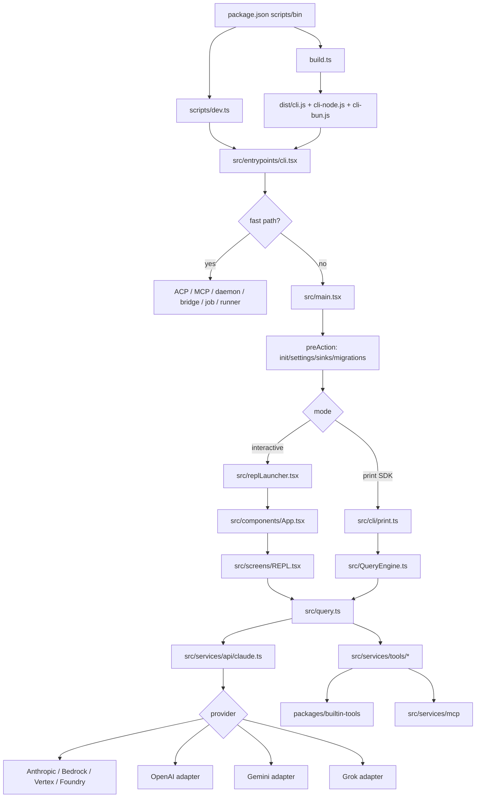

# Claude Code 代码架构分析

本文从代码路径而不是产品功能角度梳理本仓库的架构。当前仓库是一个 Bun 驱动的 CLI monorepo: 根包负责 CLI 入口、运行时状态、模型调用和 UI，`packages/` 下的 workspace 包承载内置工具、MCP/ACP、Ink 框架、Remote Control Server 和若干 native addon。

## 一页总览

Claude Code 的运行时可以按三条主路径理解:

- 特殊模式 fast path: `--version`、Chrome/Computer Use MCP、ACP、daemon、remote-control、job、runner 等在 `src/entrypoints/cli.tsx` 里直接分发，不加载完整 CLI。
- 交互模式: 默认进入 `src/main.tsx` 的 Commander 主命令，再渲染 Ink REPL，用户输入经 `src/screens/REPL.tsx` 调用 `src/query.ts`。
- 非交互/SDK 模式: `-p/--print` 由 `src/main.tsx` 构造 headless state，进入 `src/cli/print.ts`，再经 `src/QueryEngine.ts` 调用 `src/query.ts`。



## 分层职责

| 层 | 主要文件 | 职责 |
| --- | --- | --- |
| 包与构建 | `package.json`, `scripts/dev.ts`, `build.ts` | 声明 CLI 命令、workspace、dev 启动、Bun build、产物入口 |
| 入口分发 | `src/entrypoints/cli.tsx` | 轻量解析 argv，处理 fast path，最后动态加载完整 CLI |
| CLI 编排 | `src/main.tsx` | Commander 命令定义、启动初始化、模式分流、权限/MCP/插件/会话准备 |
| 交互 UI | `src/replLauncher.tsx`, `src/components/App.tsx`, `src/screens/REPL.tsx` | Ink 渲染、React state provider、输入队列、消息展示、交互式工具权限 |
| Headless/SDK | `src/cli/print.ts`, `src/QueryEngine.ts` | `-p`/SDK stream-json、结构化 IO、会话恢复、SDK 消息输出 |
| Agentic loop | `src/query.ts` | 多轮模型请求、上下文压缩、流式事件处理、工具执行、停止/继续条件 |
| API 层 | `src/services/api/claude.ts`, `src/services/api/{openai,gemini,grok}` | 请求归一化、tool schema、provider 选择、流适配、usage/cost |
| Tool 层 | `src/Tool.ts`, `src/tools.ts`, `src/services/tools/*`, `packages/builtin-tools` | Tool 接口、内置工具注册、权限检查、hook、并发执行、tool_result 生成 |
| 状态层 | `src/state/*`, `src/bootstrap/state.ts` | AppState store、session-global 单例、MCP/插件/任务/权限状态 |
| 持久化 | `src/utils/sessionStorage.ts`, `src/types/logs.ts` | transcript JSONL、parentUuid 链、resume、subagent transcript |
| 扩展系统 | `src/services/mcp`, `src/commands.ts`, `src/skills/*`, `src/utils/plugins/*` | MCP 工具/资源/命令、slash command、skill、plugin |

## 包、运行与构建

根 `package.json` 的 `bin` 将发布后的命令映射到构建产物: `ccb` 和 `claude-code-best` 指向 `dist/cli-node.js`，`ccb-bun` 指向 `dist/cli-bun.js`。开发脚本则是 `bun run dev`，它最终执行 `scripts/dev.ts`。

`scripts/dev.ts` 做两件关键事:

- 通过 Bun `-d` 注入 `MACRO.*` define，避免直接跑源码时缺少版本、构建时间等常量。
- 将 `DEFAULT_BUILD_FEATURES` 和环境变量 `FEATURE_*` 转成 Bun `--feature` 参数，再启动 `src/entrypoints/cli.tsx`。

`build.ts` 用 `Bun.build()` 以 `src/entrypoints/cli.tsx` 为入口输出到 `dist/`，开启 code splitting，并做两类后处理:

- 把 Bun-only 的 `import.meta.require` 替换成 Node 兼容的 `createRequire` fallback。
- 生成 `dist/cli-bun.js` 和 `dist/cli-node.js` 两个可执行 wrapper，并复制 native/vendor 资源。

代码位置: `package.json:24-49`, `scripts/dev.ts:17-57`, `build.ts:18-108`。

## 入口与启动分发

`src/entrypoints/cli.tsx` 是真正入口。它非常克制: 先设置少量全局环境，再按 argv 做动态 import。这样 `--version` 可以零重模块加载，MCP/daemon/bridge 等独立模式也不用付完整 CLI 的 import 成本。

核心分发顺序:

- `--version` 直接打印 `MACRO.VERSION`。
- `--dump-system-prompt`、Chrome MCP、Computer Use MCP、ACP 直接进入各自 entry。
- `--daemon-worker`、`remote-control/rc/bridge`、`daemon`、`--bg`、`job`、runner 等进入对应子系统。
- `--worktree --tmux` 可以在加载完整 CLI 前先尝试 exec 到 tmux/worktree。
- 其他情况启动 early input capture，然后动态 import `src/main.jsx` 并调用 `main()`。

代码位置: `src/entrypoints/cli.tsx:71-82`, `src/entrypoints/cli.tsx:106-128`, `src/entrypoints/cli.tsx:159-225`, `src/entrypoints/cli.tsx:371-377`。

## Commander 主 CLI

`src/main.tsx` 是完整 CLI 的中枢，代码量大，但结构可以拆成三段:

1. 顶部 import 与启动优化: MDM/keychain 预读、feature-gated require、各种服务依赖。
2. `program.hook('preAction')`: 只有真正执行命令时才跑 `init()`、sinks、migration、remote managed settings、settings sync。
3. 根命令 `.action(...)`: 解析主会话参数，准备认证、模型、permission context、MCP、插件、commands、agents、hooks，然后分流到 print 或 REPL。

主命令本身定义了 `-p/--print`、`--bare`、`--mcp-config`、`--permission-mode`、`--resume`、`--model`、`--agents`、`--plugin-dir`、`--chrome` 等会话级参数。后面还注册 `mcp`、`auth`、`plugin`、`agents`、`doctor`、`update` 等子命令。

关键分流:

- print/headless: 构造 `headlessInitialState`，创建 store，连接 MCP，然后 `import('src/cli/print.js')` 调 `runHeadless()`。
- interactive: 准备 `initialState`、resume 数据和 hook messages，然后 `launchRepl()`。

代码位置: `src/main.tsx:1076-1139`, `src/main.tsx:1141-1425`, `src/main.tsx:3122-3364`, `src/main.tsx:4372-4495`。

## 交互模式: Ink REPL

交互模式的渲染边界很薄:

- `src/replLauncher.tsx` 动态加载 `App`、`SentryErrorBoundary`、`REPL`，并把它们交给 `renderAndRun()`。
- `src/components/App.tsx` 提供 FPS、stats、`AppStateProvider`、Ink `ThemeProvider`。
- `src/state/AppState.tsx` 通过 `createStore()` 创建单例 store，`useAppState(selector)` 用 `useSyncExternalStore` 订阅切片，避免整棵组件树因 AppState 变化重渲染。

REPL 的一次用户提交大致是:

1. 用户输入进入 REPL 的消息队列/输入处理。
2. REPL 组装 `ToolUseContext`，从 store 获取最新 tools/MCP clients。
3. 并发加载 default system prompt、user context、system context。
4. 调用 `query({ messages, systemPrompt, userContext, systemContext, canUseTool, toolUseContext })`。
5. `onQueryEvent(event)` 将 stream event、assistant message、tool result、progress 等写回 UI state。

当前代码里，REPL 直接调用 `src/query.ts`。`QueryEngine` 注释里说它未来也可给 REPL 使用，但当前 headless/SDK 路径才实际走 `QueryEngine`。

代码位置: `src/replLauncher.tsx:14-30`, `src/components/App.tsx:21-35`, `src/state/AppState.tsx:59-102`, `src/screens/REPL.tsx:3359-3413`。

## Headless/SDK 模式

`-p/--print` 和 SDK 走 `src/cli/print.ts`。这条路径没有 React tree，所以它要自己订阅 settings change、维护 structured IO、处理中断、SDK status、权限 prompt tool、stream-json 输出和输入去重。

`runHeadless()` 负责全局准备，内部的 streaming runner 再驱动 turn 队列。真正的模型 turn 由 `QueryEngine` 承接:

- `QueryEngine` 保存 conversation 级状态: `mutableMessages`、read file cache、permission denials、usage 等。
- 每次 `submitMessage()` 是一个 turn: 处理用户输入和 slash command，提前写 transcript，构建 system prompt，yield SDK init message，然后调用 `query()`。
- `query()` 的输出再被映射成 SDK stdout message/result。

代码位置: `src/cli/print.ts:458-600`, `src/cli/print.ts:1000-1104`, `src/QueryEngine.ts:183-190`, `src/QueryEngine.ts:217-249`, `src/QueryEngine.ts:420-438`, `src/QueryEngine.ts:688-699`。

## Agentic Loop

`src/query.ts` 是核心 agent loop。可以把一次 turn 看成这个循环:

```text
messages
  -> compact/snip/microcompact/context projection
  -> API request
  -> stream assistant content
  -> detect tool_use blocks
  -> run tools and produce tool_result user messages
  -> append attachments/queued commands/hook results
  -> continue next model request
  -> no tool_use or terminal condition: stop
```

`query()` 外层负责 Langfuse trace、autonomy command finalization、generator cleanup。`queryLoop()` 内部持有跨迭代 state，比如 messages、toolUseContext、autoCompactTracking、turnCount、pendingToolUseSummary。

几个关键点:

- 是否需要下一轮，不完全信任 API 的 `stop_reason === 'tool_use'`，而是流式期间只要看到 `tool_use` block 就设置 `needsFollowUp`。
- 支持 streaming tool execution: 工具可以在模型流式输出 tool_use 后提前开始，剩余结果在 stream 结束后补齐。
- 如果未启用 streaming tool execution，则批量调用 `runTools()`。
- 工具执行后产生的 `tool_result` 被规范化成 user message，作为下一次 API 请求输入。
- abort、max turns、hook stopped、prompt too long、fallback model、reactive compact、token budget 等都是 loop 的 terminal 或 continue 分支。

代码位置: `src/query.ts:275-389`, `src/query.ts:392-459`, `src/query.ts:734-751`, `src/query.ts:1038-1087`, `src/query.ts:1640-1683`, `src/query.ts:1763-1794`。

## API 层与 Provider 适配

`src/services/api/claude.ts` 的 `queryModel()` 是模型请求的共享入口。它先做和 provider 无关的准备:

- 根据模型、tool pool、permission context 判断是否启用 SearchExtraTools。
- 过滤 deferred tools，构造 API tool schemas。
- `normalizeMessagesForAPI()` 规整消息，修复 tool_use/tool_result 配对，剥离不被当前 provider/model 支持的字段。
- 控制 prompt caching、betas、thinking、media 限制、advisor 等。

provider 分流发生在 shared preprocessing 之后:

- `openai`: `queryModelOpenAI()` 将 Anthropic messages/tools 转成 OpenAI 格式，调用 OpenAI-compatible endpoint，再把流适配回 Anthropic raw stream event。
- `gemini`: `queryModelGemini()` 走 Gemini 独立 adapter。
- `grok`: `queryModelGrok()` 复用 OpenAI converter/stream adapter，但 client 和 model mapping 独立。
- 其他 provider: firstParty/Bedrock/Vertex/Foundry 继续走 Anthropic SDK 风格的 streaming path。

provider 选择在 `src/utils/model/providers.ts`: settings `modelType` 优先，其次环境变量 `CLAUDE_CODE_USE_*`，最后默认 `firstParty`。

代码位置: `src/services/api/claude.ts:1039-1094`, `src/services/api/claude.ts:1140-1263`, `src/services/api/claude.ts:1279-1330`, `src/services/api/claude.ts:1331-1372`, `src/utils/model/providers.ts:6-31`。

## Tool 系统

Tool 的统一接口在 `src/Tool.ts`。一个 tool 至少包含:

- `name`、`inputSchema`、`call()`、`description()`。
- `isEnabled()`、`isReadOnly()`、`isConcurrencySafe()`。
- 可选的 `validateInput()`、`needsPermissions()`、`mapToolResultToToolResultBlockParam()`、MCP metadata、deferred/alwaysLoad 标记等。

`src/tools.ts` 是内置工具注册表。`getAllBaseTools()` 列出所有可能内置工具，很多工具通过 feature flag、`USER_TYPE` 或环境变量条件加入。`getTools()` 负责按 simple mode、REPL mode、deny rules、`isEnabled()` 过滤。`assembleToolPool()` 再把 built-in tools 和 MCP tools 合并、按名称稳定排序并去重。

工具执行链:

1. `query.ts` 从 assistant message 中收集 `tool_use` blocks。
2. `runTools()` 将 consecutive read-only/concurrency-safe 工具分组并发执行，非安全工具串行执行。
3. `runToolUse()` 查找 tool、处理 alias/fallback、检查 abort。
4. `streamedCheckPermissionsAndCallTool()` 包一层 progress stream。
5. 内部执行 input schema、权限、PreToolUse/PostToolUse hooks、`tool.call()`。
6. 最终把 tool output 映射为 `tool_result` user message 回到 query loop。

代码位置: `src/Tool.ts:383-487`, `src/tools.ts:217-280`, `src/tools.ts:301-397`, `src/services/tools/toolOrchestration.ts:20-97`, `src/services/tools/toolOrchestration.ts:101-130`, `src/services/tools/toolExecution.ts:366-519`, `src/services/tools/toolExecution.ts:521-599`。

## MCP、Commands、Skills、Plugins

这几个系统最后都汇入两类模型可见能力: tool 或 slash command。

MCP:

- `src/services/mcp/client.ts` 负责连接 server，获取 tools/prompts/resources。
- MCP tools 会变成 `mcp__server__tool` 形态的 Tool，并带 `mcpInfo`。
- REPL 通过 `useManageMCPConnections` 持续维护连接和 list_changed 更新；headless 则在 `main.tsx` print branch 中尽量先连接，让单轮 `-p` 也能看到工具。

Commands/Skills:

- `src/commands.ts` 聚合内置 slash commands、动态 skills、plugin commands、MCP prompt commands。
- `getSlashCommandToolSkills()` 会筛出可由模型通过 `SkillTool` 调用的 prompt commands。
- `src/skills/bundled/index.ts` 注册内置 skills。

Plugins:

- `src/utils/plugins/pluginLoader.ts` 负责从 session `--plugin-dir`、marketplace installed plugins、builtin plugins 加载插件。
- plugin 可以贡献 commands、skills、agents、hooks、MCP servers、settings。
- session plugin 一般优先于 installed plugin，但 managed settings 锁定的插件优先级更高。

代码位置: `src/services/mcp/client.ts:1743-1786`, `src/services/mcp/client.ts:2238-2382`, `src/commands.ts:428-460`, `src/commands.ts:521-584`, `src/skills/bundled/index.ts:27-69`, `src/utils/plugins/pluginLoader.ts:3070-3206`。

## 状态与持久化

交互态的 AppState 包含当前会话的大部分 UI/运行时状态: settings、model、permission context、MCP clients/tools/commands/resources、plugins、agents、tasks、todos、file history、attribution、notifications、prompt suggestion、bridge 状态等。

状态层的几个边界:

- `src/state/store.ts` 是一个极简 external store: `getState`、`setState`、`subscribe`。
- `src/state/AppState.tsx` 用 React context 暴露 store，并通过 selector 订阅。
- `src/state/AppStateStore.ts` 定义 AppState 类型和 `getDefaultAppState()`。
- `src/bootstrap/state.ts` 则是 session-global 单例，保存 session id、cwd、project dir、model override、permission mode 等不完全属于 React state 的全局状态。

会话持久化主要在 `src/utils/sessionStorage.ts`:

- transcript 写到 Claude config home 下的 `projects/<sanitized-cwd>/<sessionId>.jsonl`。
- transcript message 类型包括 user、assistant、attachment、system；progress 是 UI-only，不应进入持久化链。
- parentUuid 链用于恢复会话，legacy progress 会在读取时桥接。
- subagent transcript 放在当前 session 目录下的 `subagents/` 子目录。

代码位置: `src/state/store.ts:10-33`, `src/state/AppState.tsx:129-155`, `src/state/AppStateStore.ts:90-162`, `src/state/AppStateStore.ts:460-520`, `src/utils/sessionStorage.ts:128-156`, `src/utils/sessionStorage.ts:198-258`。

## 重要子系统

Bridge / Remote Control:

- CLI fast path: `src/entrypoints/cli.tsx` 中的 `remote-control/rc/bridge` 分支。
- 本地 CLI 可作为 bridge environment，通过 `src/bridge/bridgeMain.ts` 和 `packages/remote-control-server` 让远端 UI 控制本地会话。

ACP:

- `--acp` fast path 进入 `src/services/acp/entry.ts`。
- `packages/acp-link` 提供 WebSocket 到 ACP agent 的桥接能力。

Daemon / background sessions:

- `daemon` 和 `--daemon-worker` 在 entrypoint fast path 处理。
- `src/daemon` 管 supervisor/worker registry，和 background session 子命令。

Agent / subagent:

- `AgentTool` 在 `packages/builtin-tools`。
- subagent 仍然走同一套 `query()` 和 tool execution，只是 `ToolUseContext.agentId`、transcript path、Langfuse trace 和权限处理会变。

## 推荐读代码顺序

如果是第一次读，建议不要从 `src/main.tsx` 顶到尾硬读。更快的顺序是:

1. `package.json`、`scripts/dev.ts`、`build.ts`: 先知道怎么跑和怎么出产物。
2. `src/entrypoints/cli.tsx`: 看所有 fast path 和完整 CLI 的加载边界。
3. `src/main.tsx`: 只看 `preAction`、根 `.action()`、print branch、REPL launch branch。
4. `src/replLauncher.tsx`、`src/screens/REPL.tsx` 的 `query({ ... })` 调用点。
5. `src/cli/print.ts` 和 `src/QueryEngine.ts`: 对照 headless 路径。
6. `src/query.ts`: 重点看 `query()`、`queryLoop()`、工具执行后的 continue 分支。
7. `src/services/api/claude.ts`: 看 `queryModel()` 的 tool schema、message normalize、provider branch。
8. `src/Tool.ts`、`src/tools.ts`、`src/services/tools/*`: 看工具注册、权限和执行。
9. `src/state/*`、`src/utils/sessionStorage.ts`: 看状态和 resume。

## 常见问题定位

| 问题 | 先看哪里 |
| --- | --- |
| CLI 参数为什么没生效 | `src/entrypoints/cli.tsx`, `src/main.tsx` |
| `bun run dev` 和构建产物有什么差别 | `scripts/dev.ts`, `build.ts`, `scripts/defines.ts` |
| `-p` 为什么和 REPL 行为不一样 | `src/main.tsx` print branch, `src/cli/print.ts`, `src/QueryEngine.ts` |
| 模型请求里 tools/messages 长什么样 | `src/services/api/claude.ts`, `src/utils/messages.ts` |
| 工具为什么没出现在模型可用 tools 里 | `src/tools.ts`, `src/services/api/claude.ts`, `src/utils/searchExtraTools.ts` |
| 工具为什么串行/并发 | `src/services/tools/toolOrchestration.ts` |
| 工具权限为什么弹窗/拒绝 | `src/services/tools/toolExecution.ts`, `src/hooks/useCanUseTool.ts`, `src/utils/permissions/*` |
| MCP 工具为什么没有出现 | `src/services/mcp/client.ts`, `src/services/mcp/useManageMCPConnections.ts`, `src/main.tsx` print MCP branch |
| resume 为什么恢复不到消息 | `src/utils/sessionStorage.ts`, `src/QueryEngine.ts`, `src/main.tsx` resume branch |
| UI 为什么没重渲染或重渲染太多 | `src/state/AppState.tsx`, `src/state/store.ts`, `src/screens/REPL.tsx` |

## 总结

这套代码的核心不是一个简单的 “CLI 调 API”。它更像一个多入口 runtime:

- `cli.tsx` 负责轻量模式分发。
- `main.tsx` 负责把用户会话装配成 interactive 或 headless runtime。
- `REPL` 和 `QueryEngine` 分别服务交互态与 SDK/headless。
- `query.ts` 是唯一真正的 agent loop 中心。
- `claude.ts` 把模型请求、provider adapter、tool schema 和消息归一化收束在 API 边界。
- `Tool`/`tools.ts`/`services/tools` 把模型的 tool_use 变成真实副作用，再把结果喂回下一轮。
- `AppState` 和 transcript JSONL 分别支撑 UI 反应性与会话恢复。

读任何具体问题时，先判断它发生在启动分发、会话装配、agent loop、API 适配、工具执行、UI state、还是持久化层，基本就能快速落到正确文件。
